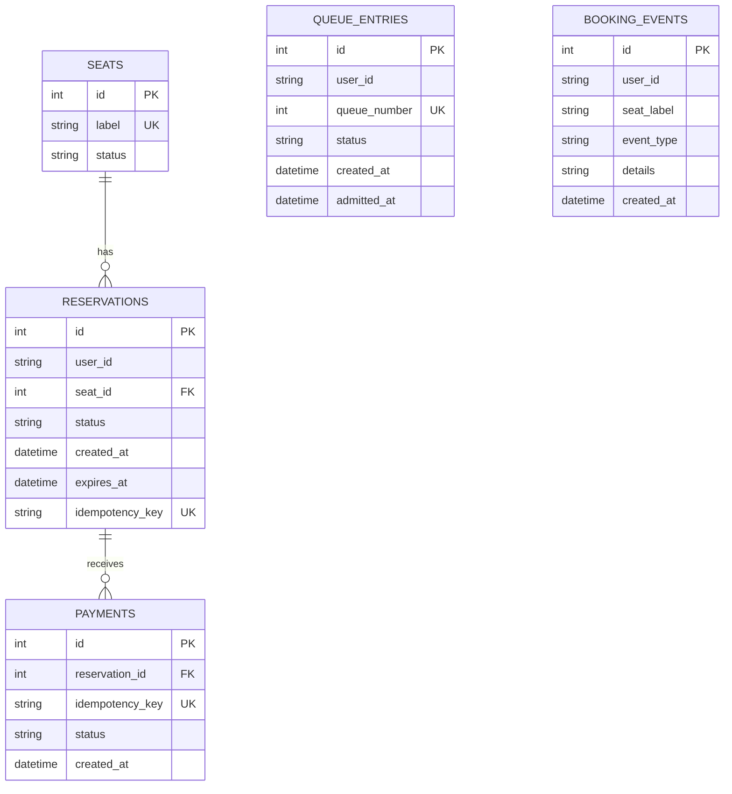

# HoldMySeat ER diagram

```mermaid
erDiagram
    SEATS ||--o{ RESERVATIONS : has
    RESERVATIONS ||--o{ PAYMENTS : receives
    QUEUE_ENTRIES {
        int id PK
        string user_id
        int queue_number UK
        string status
        datetime created_at
        datetime admitted_at
    }
    SEATS {
        int id PK
        string label UK
        string status
    }
    RESERVATIONS {
        int id PK
        string user_id
        int seat_id FK
        string status
        datetime created_at
        datetime expires_at
        string idempotency_key UK
    }
    PAYMENTS {
        int id PK
        int reservation_id FK
        string idempotency_key UK
        string status
        datetime created_at
    }
    BOOKING_EVENTS {
        int id PK
        string user_id
        string seat_label
        string event_type
        string details
        datetime created_at
    }
```

`booking_events` is an audit table and intentionally stores the seat label as a snapshot so that queue and reservation events can also be recorded.
